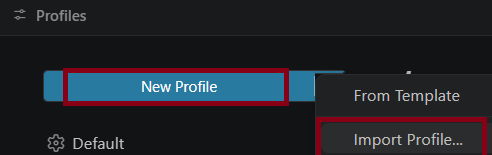
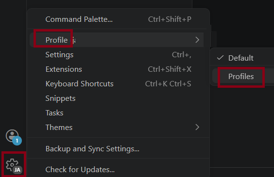
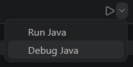
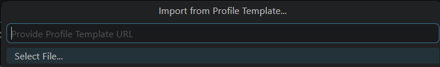

# Guía de Configuración para VS Code: Entorno de Programación Limpio

**Guía para el Estudiante — Importar el Entorno**

> **Objetivo:** Configurar tu editor para que sea una herramienta de aprendizaje real, eliminando distracciones y ayudándote a fijar los conocimientos de Java.

---

## Paso 1: Importar el Perfil de Clase

1. Descargá el archivo [`java-utu.code-profile`](./java-utu.code-profile) desde **[AQUÍ](./java-utu.code-profile)**
2. En VS Code, hacé clic en el **engranaje** (abajo a la izquierda).
3. Seleccioná **Profiles > Profile > Profile...**
4. Hacé clic en **New Profile > Import Profile...**



5. Elegí el archivo que descargaste.



6. Hacé clic en **Create Profile**. ¡Listo! Tu editor ahora tiene las mismas reglas que el de la clase.

---

## Paso 2: ¿Qué cambió en mi editor?

Para fomentar tu memoria técnica, hemos aplicado estos cambios:

- **Sin sugerencias automáticas:** El editor no te dirá qué escribir mientras tipeás. Debés esforzarte por recordar la sintaxis.
- **Interfaz limpia:** Se eliminó el "minimapa" de la derecha y los textos de "Run/Debug" para que veas solo tu código.
- **Sin etiquetas extra:** No verás etiquetas como `x:` dentro de los paréntesis del `System.out.println`.

---

## Paso 3: Ejecución y Resultados

Para que tu trabajo sea prolijo, los resultados no aparecerán en la "Terminal" común.

1. Dale al botón de **Play** arriba a la derecha.



2. Mirá la pestaña **Consola de depuración** (o *Debug Console*) en la parte inferior.



3. Ahí verás la salida de tu programa limpia, sin rutas de archivos ni comandos del sistema.

> En caso de que esto no funcione, elegí en el Play la opción **Debug Java**.

---

## Recordatorios: ¿Cómo usar la ayuda manual?

Aunque desactivamos las sugerencias automáticas para que "no piensen por vos", podés llamar a la ayuda del editor cuando realmente la necesites usando el atajo **`Ctrl + Espacio`**.

Aquí tenés los ejemplos más útiles para tus clases de Java:

- **Estructura principal (`main`):** Escribí la palabra `main` y luego presioná `Ctrl + Espacio`. El editor te ofrecerá completar todo el bloque:
  ```java
  public static void main(String[] args) { ... }
  ```

- **Imprimir en consola (`syso`):** Escribí `syso` y presioná `Ctrl + Espacio`. Se transformará automáticamente en:
  ```java
  System.out.println();
  ```

- **Constructores y Métodos:** Si estás creando un objeto y no recordás los parámetros, presioná `Ctrl + Espacio` dentro de los paréntesis para ver qué datos recibe.

- **Importaciones automáticas:** Si escribís una clase como `Scanner` o `ArrayList`, al presionar el atajo, el editor te ayudará a realizar el `import` correspondiente al principio del archivo.

---

> ¿Querés migrar tu configuración existente de VS Code a otra máquina? Consultá la [Guía de Migración completa](./clonar%20configuraci%C3%B3n%20vsCode.md).

> **Consejo de la docente:** El objetivo de este perfil es que cuando te enfrentes a una hoja de papel o a una prueba, tu cerebro ya sepa escribir el código sin depender de que la computadora lo complete por vos. ¡A programar!

---

<p align="center">
  <a rel="license" href="http://creativecommons.org/licenses/by-sa/4.0/">
    
  </a>
  <br>
  <strong>Prof. Elizabeth Izquierdo</strong>
</p>
